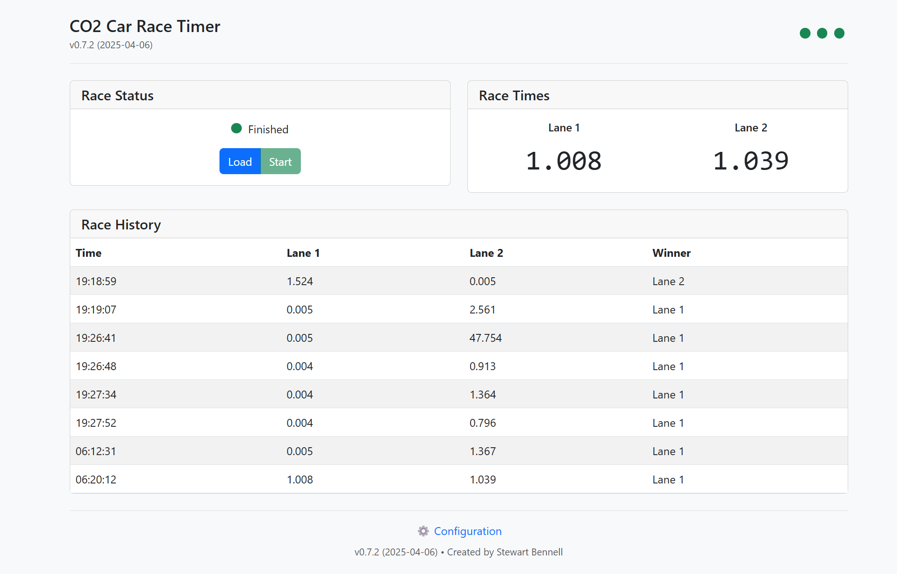
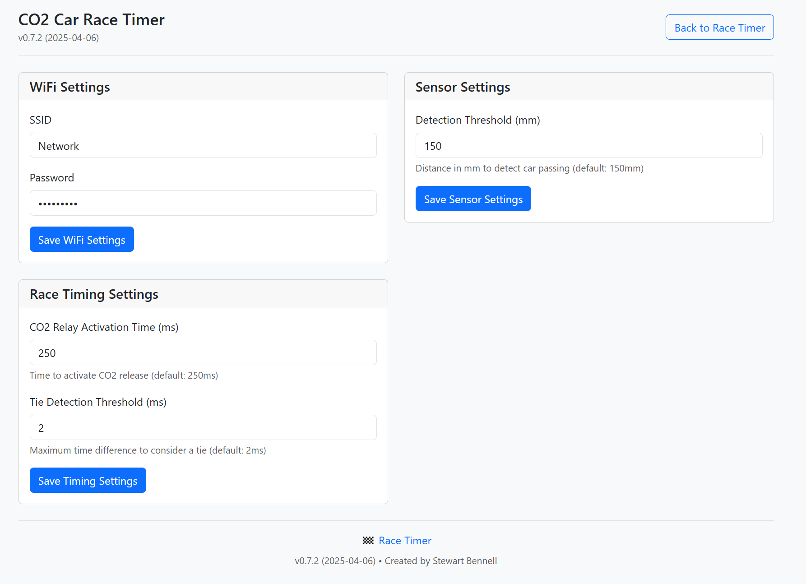

# CO₂ Car Race Timer

## Description

The **CO₂ Car Race Timer** is an automated race timer system designed for CO₂-powered cars. It uses two VL53L0X distance sensors to measure the time taken for each car to cross the finish line. The system integrates a relay to trigger the CO₂ firing mechanism and provides race results based on the fastest time. 

The system features a responsive web interface for remote control and monitoring. Users can load cars and start races through either physical buttons or the web interface. Real-time race status, timing updates, and sensor health are displayed both on the physical device and the web UI. Race results are automatically saved and can be viewed in the race history table.

## Features

### Hardware Features
- **Two VL53L0X distance sensors**: Tracks the cars as they pass through the sensor line
- **Relay control**: Fires the CO₂ mechanism to start the race
- **Physical controls**: Load and start buttons with proper debouncing
- **LED indicators**: Visual feedback of race state (waiting, ready, racing, finished)
- **Buzzer feedback**: Audible cues at race start and finish
- **Advanced tie detection**: Real-time detection with 2ms tolerance, consistent handling across all components

### Web Interface Features
- **Responsive design**: Mobile-friendly interface with touch controls
- **Real-time updates**: Live race status and timing information
- **Race history**: Track and display previous race results with consistent tie handling
- **System monitoring**: WiFi signal strength and sensor health indicators
- **Remote control**: Load cars and start races from any device
- **WebSocket communication**: Instant updates without page refreshes
- **Tie handling**: Shows identical times for tied races
- **Dual Network Mode**:
  - **Station Mode**: Connects to existing WiFi network with robust reconnection
  - **AP Mode**: Creates its own network (SSID: CO2RaceTimer-XXXX, Password: co2racer) when WiFi unavailable
  - **Auto-switching**: Falls back to AP mode if WiFi connection fails
  - **Async Events**: Non-blocking WiFi handling for improved stability

#### Web Interface Screenshots

##### Main Race Interface


##### Configuration Interface


## Hardware Requirements

- **Two VL53L0X distance sensors**: Used to track the cars' progress through the track.
- **Relay module**: Triggers the CO₂ firing mechanism.
- **Load button**: Used to signify when the cars are loaded.
- **Start button**: Used to start the race after the cars are loaded.
- **ESP32**: Manages communication between the sensors, relay, buttons, and the system logic.
- **Tri-color LED**: Visual indication of system state.
- **Buzzer**: Provides audible feedback for race events.

## Pinout

| ESP32 Pin | Component            | Notes                    |
|-----------|----------------------|--------------------------||
| GPIO21    | I2C SDA              | Shared by both sensors   |
| GPIO22    | I2C SCL              | Shared by both sensors   |
| GPIO16    | Sensor 1 XSHUT       | VL53L0X address: 0x30   |
| GPIO17    | Sensor 2 XSHUT       | VL53L0X address: 0x31   |
| GPIO4     | Load Button (INPUT)  | With internal pullup    |
| GPIO5     | Start Button (INPUT) | With internal pullup    |
| GPIO14    | Relay (OUTPUT)       | Active LOW              |
| GPIO27    | Buzzer (OUTPUT)      | Active HIGH             |
| GPIO25    | LED Red (OUTPUT)     | Active HIGH             |
| GPIO26    | LED Green (OUTPUT)   | Active HIGH             |
| GPIO33    | LED Blue (OUTPUT)    | Active HIGH             |

## Installation

### 1. Hardware Setup

- **VL53L0X Sensors**: Connect both sensors to the Arduino Uno via I2C (A4/SDA and A5/SCL pins). Use `XSHUT` pins (Digital 2 and Digital 3) to reset each sensor individually.
- **Relay Module**: Connect the relay to Digital 8 on the Arduino Uno to trigger the CO₂ mechanism.
- **Buttons**: Connect the load button to Digital 4 and the start button to Digital 5.
- **LED**: Connect the tri-color LED to pins 10 (Red), 11 (Green), and 12 (Blue).
- **Buzzer**: Connect the buzzer to Digital 9.

### 2. Software Setup

1. **Install PlatformIO**: 
   - Install [VS Code](https://code.visualstudio.com/)
   - Install the PlatformIO extension

2. **Required Libraries**: The following libraries are automatically managed by PlatformIO:
   - `pololu/VL53L0X`: Distance sensor control
   - `me-no-dev/ESPAsyncWebServer`: Web server functionality
   - `me-no-dev/AsyncTCP`: WebSocket support
   - `bblanchon/ArduinoJson`: JSON data handling

3. **Network Setup**:
   - **First Boot**:
     - Device starts in AP mode for initial setup
     - SSID: `CO2RaceTimer-XXXX` (XXXX = last 4 digits of MAC)
     - Password: `co2racer`
     - IP Address: 192.168.4.1
   - **WiFi Configuration**:
     - Connect to the AP and navigate to 192.168.4.1
     - Use the configuration page to set up WiFi credentials
     - Device will automatically connect to configured network
   - **AP Mode Fallback**:
     - If WiFi connection fails, device reverts to AP mode
     - Clear settings through web interface to reconfigure

4. **Web Interface Setup**:
   - Connect to either your WiFi network or the device's AP
   - Navigate to the device's IP address in a web browser
   - Use the web interface to control and monitor races
   ```ini
   lib_deps =
     pololu/VL53L0X @ ^1.3.1
     bblanchon/ArduinoJson @ ^6.21.3
   ```

### 3. Upload Code to ESP32

1. Open the project in VS Code with PlatformIO
2. Connect your ESP32 via USB
3. Click the PlatformIO Upload button or use `pio run -t upload`

### 4. Monitor Serial Output

Open the PlatformIO Serial Monitor (115200 baud) using:
- Click the "Serial Monitor" button in PlatformIO
- Or use `pio device monitor`

## Usage

### 1. **Loading the Cars**
- **Via Load Button**: Press the **Load Button** (Digital 4) to signify that the cars are loaded and ready to race.
- **Via Serial Command**: Send **'L'** via Serial Monitor to load the cars.

Once the cars are loaded, the system will display a message indicating that the cars are ready to race, and the LED will show **amber** (red + green).

### 2. **Starting the Race**
- **Via Start Button**: Press the **Start Button** (Digital 5) to begin the race once the cars are loaded.
- **Via Serial Command**: Send **'S'** via Serial Monitor to start the race.

When the race starts, you'll hear a short beep and the LED will turn **blue**.

### 3. **Race Results**
Once both cars cross the finish line, the system will display the race results with the times for each car and declare the winner. You'll hear a longer beep and the LED will turn **green**.

Example output:
```
🚦 Cars loaded. Press 'S' to start the race.
📩 Received Serial Command: S
🚦 Race Starting...
🔹 Firing CO₂ Relay...
✔ Relay deactivated
🏎 Race in progress...
📏 Sensor Readings: C1 = 145 mm, C2 = 130 mm
🏁 Car 1 Finished! Time: 1234 ms
🏁 Car 2 Finished! Time: 1120 ms
🎉 Race Finished!
🏆 Car 2 Wins!
📊 RESULT: C1=1234ms, C2=1120ms
```

### 4. **Reset for Next Race**

After the race, the system will reset and wait for the next race. To reset:
- Press 'L' via Serial or press the Load Button to load the cars again.
- The LED will turn **red** when the system is waiting for cars to be loaded.

## LED Status Indicators

| Race State | LED Color    | Meaning                                     |
|------------|--------------|---------------------------------------------|
| Waiting    | Red          | System initialized, waiting for cars         |
| Ready      | Amber (R+G)  | Cars loaded, ready to start race            |
| Racing     | Blue         | Race in progress                            |
| Finished   | Green        | Race complete, results available            |

## Configuration

### Debug Settings
- **DEBUG Mode**: Set the `#define DEBUG` flag to true in the code to enable detailed debug logging of sensor readings.
- **Debounce Delay**: The `DEBOUNCE_DELAY` constant (default: 50ms) can be adjusted to fine-tune button responsiveness.

### Race Timing Settings
- **Tie Threshold**: Configurable threshold (default: 2ms) for detecting ties. Times within this threshold are averaged and considered a tie.
- **Real-time Detection**: Ties are detected and handled in real-time as cars finish, ensuring consistent timing across all components.
- **Optimized Timing**: Network and time manager updates are paused during races for maximum timing accuracy:
  - Live race display
  - Final results
  - Race history storage

## License

This project is licensed under the MIT License - see the LICENSE file for details.

## Acknowledgements

- **VL53L0X Library**: Pololu's VL53L0X library for reliable distance sensing
- **ESP32 Platform**: Espressif's ESP32 platform providing robust I2C and GPIO management
- **PlatformIO**: Professional embedded development platform

Enjoy your CO₂ Car Race Timer! Let me know if you have any questions or improvements to suggest.